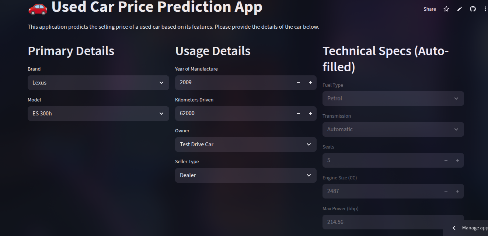

# Predicting Used Car Selling Prices

## Overview

This project is an end-to-end machine learning solution designed to predict the selling price of used cars. Starting from a raw dataset, the project covers the entire ML lifecycle, including data cleaning, exploratory data analysis (EDA), feature engineering, model benchmarking, hyperparameter tuning, and final deployment as an interactive web application.

The final recommended model, a **Tuned RandomForest Regressor**, achieves an **R-squared of 0.939** on the test set, demonstrating high accuracy in predicting vehicle prices.

**Live Application:**

- **[View the Deployed Streamlit App Here](https://predicting-car-selling-price-angeltamang.streamlit.app/)**,

_Note: The app may take some moments to cold start._


## Project Goal

The primary objective is to build a robust regression model that accurately predicts the selling price of a used car based on its features, such as age, brand, mileage, and technical specifications.

## Tech Stack

- **Data Manipulation & Analysis:** Python, Pandas, NumPy
- **Data Visualization:** Matplotlib, Seaborn
- **Machine Learning & Preprocessing:** Scikit-learn
- **Advanced Modeling:** XGBoost, LightGBM
- **Deployment:** Streamlit
- **Development Environment:** Jupyter Notebook

## Project Structure

```
.
├── final_random_forest_model.joblib   # Saved final model pipeline
├── Predicting-Car-Selling-Price/predicting-car-selling-price.ipynb       # Notebook for Entire ML workflow
├── hyperparameters tuning.ipynb     # Notebook for verbose tuning runs
├── Data/car.csv                            # Raw input data
├── Data/car_data_processed.csv             # Cleaned and feature-engineered data
├── Plots                       # Plots from Data Preprocessing and Model Training
├── app.py                             # Streamlit application script
└── requirements.txt                   # Streamlit app dependencies for deployment
```

## Workflow

The project followed a structured, multi-stage workflow:

#### 1. Data Cleaning & Preparation

The initial raw dataset of over 8,000 listings was rigorously cleaned:

- **Handled Missing Values:** Imputed over 200 missing records in `engine`, `mileage`, `max_power`, and `seats` using median and mode to preserve data integrity.
- **Corrected Data Types:** Converted `max_power` from `object` type to `float` .
- **Removed Duplicates:** Identified and dropped over 1,200 duplicate entries to prevent model bias.
- **Handled Erroneous Data:** Corrected invalid `0` values for `mileage` and `max_power`, and removed a few implausible outliers in `km_driven` (e.g., > 600,000 km).

#### 2. Exploratory Data Analysis (EDA)

- **Univariate Analysis:** Analyzed the distribution of each feature. Key findings include the heavy right-skew of `selling_price` and the bimodal distribution of `engine` size, indicating different market segments.
- **Bivariate Analysis:** Investigated relationships using scatter plots, box plots, and a correlation heatmap.
  - `max_power` and `car_age` were identified as having the strongest correlation with the selling price.
  - `transmission`, `fuel` type, `owner`, and `brand` were all confirmed to be highly significant categorical predictors.

#### 3. Feature Engineering

- **`car_age`:** Created from the `year` column to provide a more intuitive and robust measure of depreciation. The reference year was set to `2021` based on the latest data entry.
- **`brand` & `model`:** Extracted from the `name` column to isolate the impact of brand reputation from the specific vehicle trim.
- **`km_per_year`:** Engineered to capture usage intensity, a more nuanced metric than total `km_driven`.

#### 4. Model Training & Evaluation

- A robust pipeline was built using Scikit-learn's `Pipeline` and `ColumnTransformer`.
- **Target Transformation:** The target variable `selling_price` was log-transformed (`np.log1p`) to handle its skewness, a process automated with `TransformedTargetRegressor`.
- **Preprocessing:** Two preprocessor pipelines were created: one for linear models (with scaling and log-transforming skewed features) and one for tree-based models (with only one-hot encoding).
- **Feature Selection:** An `ExtraTreesRegressor` was used to calculate feature importances. The `SelectFromModel` transformer was then integrated directly into all model pipelines to automatically select the top 35 most predictive features during training, reducing noise and complexity.
- **Benchmarking:** Seven different models were benchmarked. `RandomForest`, `XGBoost`, and `LightGBM` were clear top performers.
- **Hyperparameter Tuning:** `RandomizedSearchCV` was used to find the optimal parameters for the top 3 models.
- **Ensemble Modeling:** A `VotingRegressor` was created to combine the tuned models.

## Final Model Performance

After evaluation on the held-out test set, the **Tuned RandomForest Regressor** was selected as the best final model.

| Model                    | R² Score (Test Set) | RMSE (Test Set) |
| ------------------------ | ------------------- | --------------- |
| **RandomForest (Tuned)** | **0.939**           | **₹136,889**    |
| Ensemble                 | 0.936               | ₹139,268        |
| XGBoost (Tuned)          | 0.933               | ₹143,317        |
| LightGBM (Tuned)         | 0.928               | ₹148,456        |

**Conclusion:** While the ensemble model performed exceptionally well, it did not outperform the best single model. This suggests the top models were not diverse enough in their errors for an average to improve the score. For deployment, the simpler and more performant **Tuned RandomForest** is the choice.

## How to Run App locally

### Setup

1.  Clone the repository:
    ```bash
    git clone https://github.com/angeltamang123/Predicting-Car-Selling-Price
    cd Predicting-Car-Selling-Price/
    ```
2.  Create and activate a virtual environment (recommended):
    ```bash
    python -m venv venv
    source venv/bin/activate  # On Windows: venv\Scripts\activate
    ```
3.  Install the required dependencies:
    ```bash
    pip install -r requirements.txt
    ```

### Running the Streamlit App

To start the interactive web application locally, run the following command from your terminal:

```bash
streamlit run app.py
```
